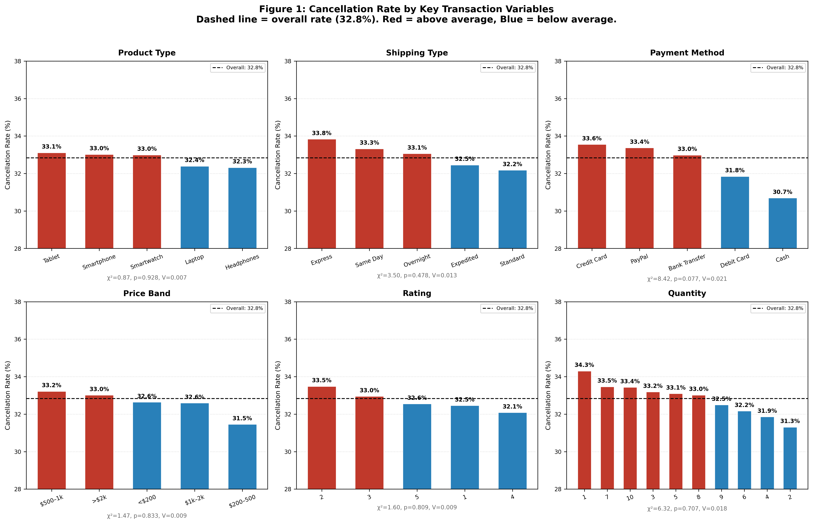
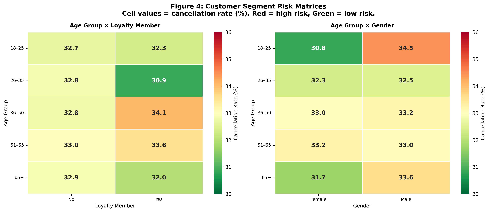
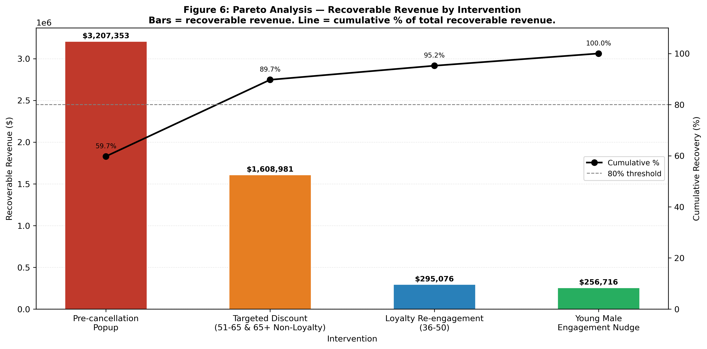
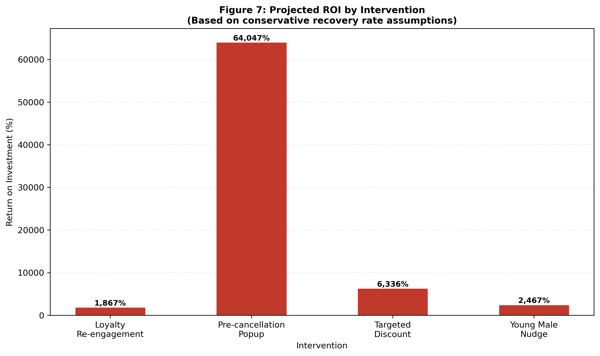

# Order Cancellation Analytics — Chi-Square, Risk Segmentation & Pareto ROI in Python

> **A end-to-end business analytics project investigating order cancellation drivers, customer risk segmentation, and ROI-driven intervention recommendations for an electronics retailer.**

---

## 🔍 Project Overview

This project analyses **20,000 electronic sales transactions** (September 2023 – September 2024) to answer three business-critical research questions:

| # | Research Question | Method |
|---|---|---|
| RQ1 | What product, shipping, and price characteristics are associated with higher cancellation rates? | Chi-square tests, Mann-Whitney U |
| RQ2 | Which customer segments face the highest cancellation risk, and what is the financial impact? | Risk matrix heatmaps, revenue quantification |
| RQ3 | What operational interventions could reduce cancellations, and what is the projected ROI? | Pareto analysis, ROI modelling |

**Key finding:** Cancellation is not a transactional phenomenon — it is a behavioural one. No product, price, or shipping variable significantly predicts cancellation (all p > 0.05). Customer segmentation reveals that loyalty members aged 36–50 and young male customers (18–25) are the highest-risk segments, and a four-intervention portfolio could recover an estimated **$4.8M in annual revenue** at a combined cost of **$30,000**.

---

## 📁 Repository Structure

```
sales_analysis/
│
├── analysis_2.py        # RQ1 — Chi-square tests + Figures 1–3
├── analysis_3.py        # RQ2 — Segmentation heatmaps + Figures 4–5
├── analysis_4.py        # RQ3 — Pareto analysis + ROI projection + Figures 6–7
├── tables.py            # Table 1 & Table 2 generation
│
├── Figure1_RQ1_cancellation_by_variable.png
├── Figure2_RQ1_payment_method.png
├── Figure3_RQ1_monthly_trend.png
├── Figure4_RQ2_risk_matrices.png
├── Figure5_RQ2_revenue_lost.png
├── Figure6_RQ3_pareto.png
├── Figure7_RQ3_roi.png
│
├── Table1_RQ1_results.png
├── Table2_RQ3_interventions.png
│
└── Individual Assignment Data File Electronic_sales.xlsx
```

---

## 📈 Key Visualisations

### RQ1 — Cancellation Rate by Transaction Variable


### RQ2 — Customer Segment Risk Matrices


### RQ3 — Pareto Analysis & ROI Projection



---

## 🛠️ Tech Stack

| Tool | Usage |
|---|---|
| **Python 3** | Core analysis language |
| **pandas** | Data cleaning, transformation, pivot tables |
| **scipy** | Chi-square tests, Mann-Whitney U test |
| **matplotlib** | All charts and visualisations |
| **seaborn** | Heatmap risk matrices |
| **numpy** | Cramér's V calculation, array operations |

---

## 🔬 Methodology

### Data Preparation
- Standardised inconsistent categorical values (PayPal capitalisation)
- Modal imputation for single missing Gender value
- Created four derived variables: `Cancelled` (binary), `Has Add-on` (binary), `Age Group` (binned), `Month` (extracted)
- Created `Price Band` variable for chi-square compatibility

### RQ1 — Chi-Square Analysis
- Tested 9 categorical variables + 1 continuous variable (Mann-Whitney U)
- Reported χ², degrees of freedom, p-value, and Cramér's V for each
- **Result:** No significant transaction-level predictor found (all p > 0.05)
- Payment Method closest to significance (p=0.077, V=0.021) — negligible practical effect

### RQ2 — Customer Segmentation
- Built pivot table risk matrices: Age Group × Loyalty Member, Age Group × Gender
- Quantified revenue loss per segment using `Order Value = Total Price + Add-on Total`
- **Key finding:** 36–50 loyalty members cancel at 34.1% — higher than non-loyalty peers (32.8%)
- Non-loyalty segments aged 51+ represent over $12M in combined revenue loss

### RQ3 — Pareto Analysis & ROI Modelling
- Proposed four data-driven interventions targeting inferred cancellation drivers
- Applied conservative recovery rate assumptions (15–25%)
- **Result:** Pre-cancellation popup alone recovers 59.7% of addressable revenue
- All four interventions ROI-positive even at 10× assumed costs

---

## 📊 Results Summary

### RQ1 — No Transaction-Level Predictors Found

| Variable | χ² | p-value | Cramér's V | Significant |
|---|---|---|---|---|
| Product Type | 0.87 | 0.928 | 0.007 | No |
| Shipping Type | 3.50 | 0.478 | 0.013 | No |
| Payment Method | 8.42 | 0.077 | 0.021 | Marginal |
| Price Band | 1.47 | 0.833 | 0.009 | No |
| Has Add-on | 0.36 | 0.547 | 0.004 | No |
| Quantity | 6.32 | 0.707 | 0.018 | No |

### RQ3 — ROI Projection

| Intervention | Cost | Recoverable Revenue | ROI |
|---|---|---|---|
| Pre-cancellation Popup | $5,000 | $3,207,353 | 64,047% |
| Targeted Discount | $25,000 | $1,608,981 | 6,336% |
| Young Male Nudge | $10,000 | $256,716 | 2,467% |
| Loyalty Re-engagement | $15,000 | $295,076 | 1,867% |

---

## 💡 Business Recommendations

1. **Implement a pre-cancellation confirmation popup** — lowest cost ($5,000), highest return ($3.2M recoverable), targets the behavioural root cause
2. **Launch targeted retention discounts** for Non-Loyalty customers aged 51–65 and 65+ — highest absolute revenue at risk ($8M+)
3. **Investigate loyalty programme effectiveness** for 36–50 age group — loyalty is not functioning as a retention mechanism for this segment
4. **Deploy young male engagement nudges** for 18–25 male customers — largest gender-based cancellation gap in the dataset

---

## 👤 Author

**Sundus Afreen**
MSc Business Analytics — BU7160 Individual Assignment
*Tools: Python · pandas · scipy · matplotlib · seaborn · Statistical Analysis · Pareto Analysis*

---

## 📄 Licence

This project is for academic and portfolio purposes. The dataset is adapted from the [Electronic Sales Dataset](https://www.kaggle.com) publicly available on Kaggle.
